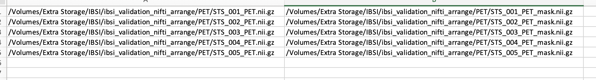

# SPAARC python: Run batch analysis with Anaconda enviroment

### [Back to Contents](README.md)

## Pre-requisites 

- Download and install [Anaconda](https://www.anaconda.com/products/distribution).
- Download spaarcpython directory.

## Create a new python environment to run SPAARC

### [Video](videos/1_c_SPAARC_python_setup_conda_enviroment.mp4)

**1. After installing Anaconda, create a new conda environment.** 

In this example the new environment is named spaarc_env

In the terminal (mac) or Anaconda Prompt (Windows) type:  

```commandline
conda create --name spaarc_env python=3.10. 
```


**2. Activate new conda environment** 

```commandline
conda activate spaarc_env
```

**3. Navigate to spaarcpython source directory**

```commandline
cd <path>/<to>/spaarcpython
```


**4. In the **activated** conda environment:
Install pip, then use pip to install requirements.txt for spaarcpython.** 


```commandline
conda install pip       
```
```commandline
pip install -r requirements.txt
```

**5. Run pytest to check code installation was successful**
```commandline
pytest
```

## Run batch analysis 

### [Video](videos/2_d_SPAARC_python_batch.mp4)

**1. Activate the above environment and navigate to the spaarcpython directory.**

**2. Have a .csv file with two columns. Each row is a patient. The first column points
to the image and the second to the corresponding mask.** 

Note this need to be full path and is machine specific, e.g: 




> The  NIfTI image and mask **MUST** be the same dimensions. 

**3. Have a [json config file](2_a_SPAARC_json_config.md)**


**4. From the conda environment terminal, inside the spaarcpython repository, run:**

```
python spaarcBatchAnalysis.py <patient_filelist.csv>  <config.json>
```


<br><br><br><br><br><br><br><br><br><br><br><br><br><br><br><br><br><br><br><br><br>


