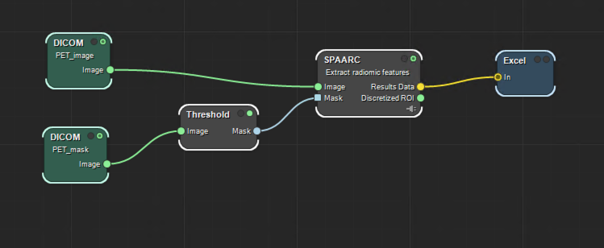

# SPAARC in MICE Toolkit: Demo Extractions

### [Back to Contents](README.md)

## The SPAARC Node 

Running feature extraction in MICE Toolkit requires 3 things:

1. Image 
2. Mask defining a Region of Interest (ROI)
3. Configuration file

## NIfTI Demo 

>_Caption_: Simple radiomics work flow  

The demo video a