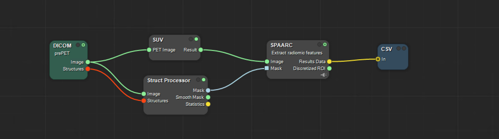

# SPAARC in MICE Toolkit: Demo Extractions

### [Back to Contents](README.md)

## The SPAARC Node 

Running feature extraction in MICE Toolkit requires 3 things:

1. Image 
2. Mask defining a Region of Interest (ROI)
3. Configuration file

## NIfTI Demo 

### [Video](videos/2_b_i_SPAARC_MICE_NIfTI.mp4)

_Caption_: Simple SPAARC radiomics work flow using NIfTI import of Image and Mask 

This demo workflow from the above video can be found:
/demos/MICE_toolkit/demo_workflow_nifti.ice

**Note** that the location of the configuration file will have to be SET manually when you open the demo.

## DICOM / Structure processor Demo

### [Video](videos/2_b_ii_SPAARC_MICE_STRUCT_DEMO.mp4)

See video example for details. 

