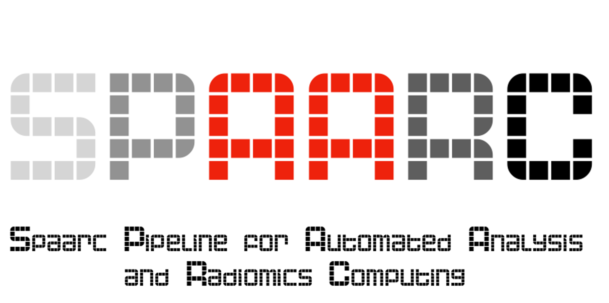

# Spaarc documentation

## Overview

SPAARC-Radiomics is a tool for multimodal quantitative image analysis developed at Cardiff University School of 
Engineering. SPAARC-Radiomics includes a total of 164 features: 23 Morphology, 
18 Intensity-based Statistics, 23 Intensity Histogram (IH), 7 Intensity-Volume Histogram (IVH),
25 Gray Level Co-occurrence Matrix (GLCM), 16 Gray Level Run Length Matrix (GLRLM), 
16 Gray Level Size Zone Matrix (GLSZM), 16 Gray Level Distance Zone Matrix (GLDZM), 
5 Neighboring Gray Tone Difference Matrix (NGTLDM), and 15 Neighborhood Gray Level 
Dependence Matrix (NGLDM). SPAARC-Radiomics features comply with the definitions provided 
by the Image Biomarker Standardization Initiative (IBSI) and are standardized following the 
IBSI guidelines (https://theibsi.github.io).

## Purpose
This repository contains text and video instructions for the use of SPAARC across different platforms 

- [MICE Toolkit](https://micetoolkit.com) / [Hero Imaging](http://heroimaging.com/spaarc) 
- Matlab
- Python 

## Contents 

### 1. Installation and configuration of SPAARC
 
- a. MICE installation and setup ([link](1_a_SPAARC_MICE_installation_and_setup.md))
- b. MATLAB installation and setup  ([link](1_b_SPAARC_MATLAB_installation_and_setup.md))
- c. Anaconda python environment installation and setup

### 2. Running radiomics analysis with SPAARC

- a. Structure of json file ([link](2_a_SPAARC_json_config.md))
- b. Running radiomics analysis in MICE Toolkit  ([link](2_b_SPAARC_MICE_Demo.md))
  - i. NIfTI example (single and batch)
  - ii. DICOM RTSTRUCT example
- c. Running radiomics analysis in MATLAB
- d. Running radiomics analysis in a Python environment (Batch)

### 3. General Tips 

                          

