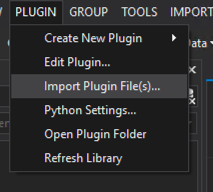
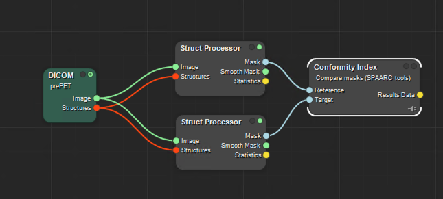
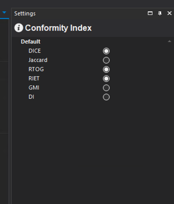

# Conformity Index plugin

### [Back to Contents](README.md)

##  Load plugin
Plugin file saved in spaarcpython directory. Load into MICE through the plugin menu if not already installed:

## Running

The plugin takes two masks, a reference and a target, as inputs. It outputs data table of conformity indicies.

 

 

The required conformity indicies can be selected in the settings panel of the plugin:

