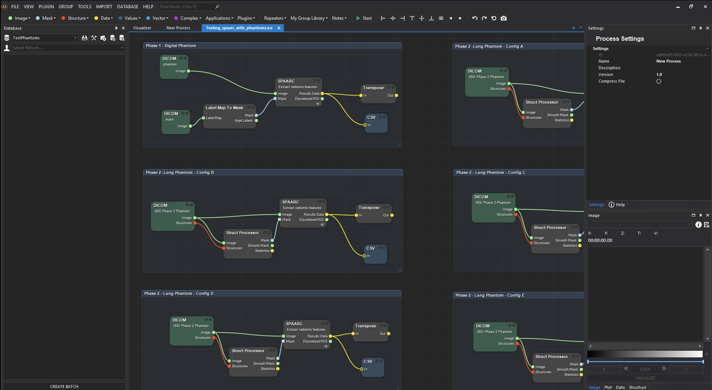
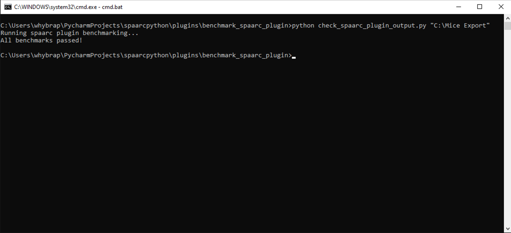

# IBSI benchmark check

### [Back to Contents](README.md)


# Pure python 
From the spaarcpython directory, running in either the Anaconda or Winpython environment you set up previously, 
simply run:
```commandline
pytest
```
This will check the current code against IBSI benchmarks. 

# Benchmarking MICE Toolkit output from a workflow. 

See video 

From the following folder:

> ~/spaarcpython/benchmark_spaarc_plugin

The workflow **Testing_spaarc_with_phantoms.ice** should be loaded into MICE. 



In the spaarc plugin nodes for the 6 tests, update all config files to point to valid config file locations!

(Note config files can be found in  ~/spaarcpython/tests)

Run workflow.

In your Winpython environment, navigate to ~/spaarcpython/benchmark_spaarc_plugin, then run 

```commandline
python check_spaarc_plugin_output.py "C:\Mice Export"
```

The last argument is where the csv files are saved from the workflow. By default, csv files are
saved in "C:\Mice Export" but this can be updated manually for each test in the workflow. 
Do not change the save names of the tests. 


If successful, you should see something like this:



